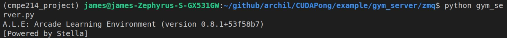
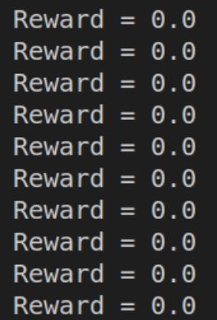
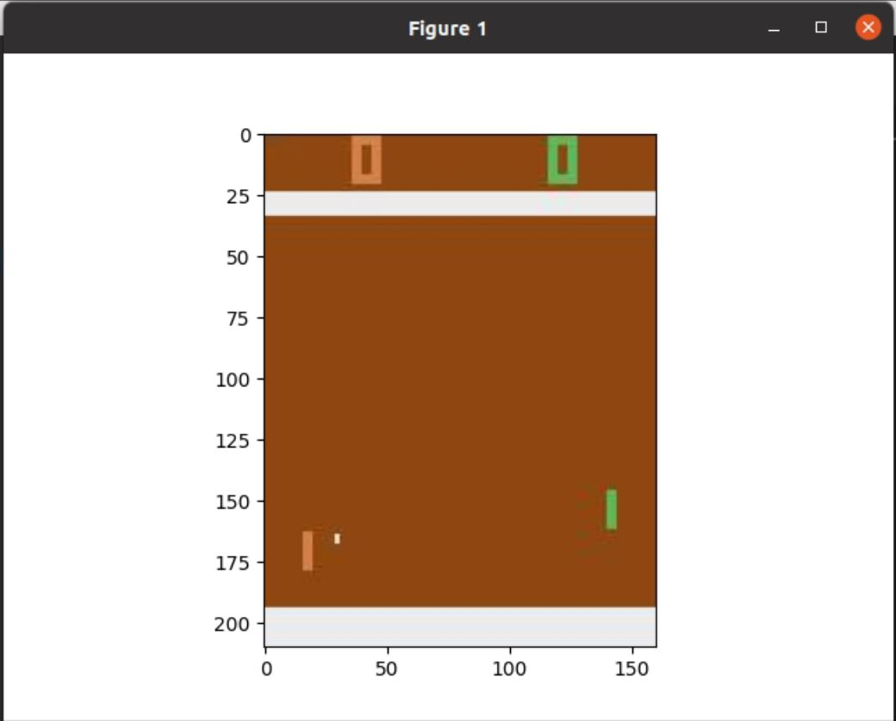

# CUDA RL Pong

Training pong agent using policy gradient implemented in CUDA

## Gym ZMQ Server & Client 

We **start the OpenAI Gym server** that waits to receive random actions (or later predicted actions) from our RL client over ZMQ:

We then **run our OpenAI RL Gym client** for it to send random actions to our OpenAI Gym server over ZMQ:

As our client sends those random actions to our server, our server renders those frames of the environment into jpeg images, and then streams them as jpeg bytes back to the client for the client to animate them to the user using matplotlib:

## References

Coming soon...
